# Transformer Architecture
The transformer step in an LLM is where the input query understanding and response generation actually happens. The key components of a transformer are 1. attention and 2. the feed-forward network(FFN) (also commonly called multi-layer perceptron (MLP)). Learning about transformers is where I really started to appreciate the sheer amount of calculations happening every time we query an LLM. Outlined below are the basics of transformer architecture for a decoder-only transformer, which is the basis for most LLMs today like GPT-series and Claude.

## Positional Encoding 
In the transformer framework you have an **embedding dictionary** which is like a dictionary of what each token represents. Conceptually, the embedding vectors represent each token's position in a multi-dimensional space, which helps represent its meaning.

These embeddings capture semantics, but not token position, so you need to add in **positional encoding**. The position of a token in a sequence matters for its meaning. For example, in "I can't wait to see the dog", the word 'dog' at the end of the sentence is the main subject of the sentence. If we swapped the position of 'I' and 'dog', the entire meaning of the sentence would change completely.

Positional information is stored in a weight matrix called P or **positional encoding matrix**. P is initialized randomly and updated through backpropagation. For each token in the input query, you look up its corresponding P vector and add it to the token's embedding vector.

In GPT-2, shape of P = [1024, 768]. This means GPT-2 can support up to 1024 tokens in its input context window. In comparison, Claude 4.6 supports 500K tokens in paid chat plans on claude.ai while Claude Code supports 1M.

With each token's positional info encoded in their respective vectors, you move on to the attention layer. 

## Attention Layer
The attention layer's purpose is to incorporate the context of surrounding tokens into each token. Why? In different contexts, each token can mean different things. Take for example, the word 'model' in the phrase 'an LLM model' vs 'a fashion model'. In different contexts, the word 'model' has different meanings. The attention layer incorporates this type of relational context into each token.

There are **multiple attention layers** in a transformer. In each layer you build more contextual understanding than the one before it. In the example of GPT-2, there are 12 attention layers.
* Early attention layers tend to address low level patterns like syntax, word order, and punctuation.
* Mid layers are more about semantic relationships: assemble phrases and begin linking context acrosss longer distances
* Late layers are more abstract and about higher level semantics, logic, and intent. (Ex. At this point, the token 'apple' means more than fruit, it also implies a tech company, a pie recipe, etc.)

Second, each attention layer contains **multiple ‘heads’**. Each head contains weights that look for different types of relationships between tokens.
* For ex in the sequence "The cat sat" (let's assume each word is a token for ease of understanding) head A may focus on syntatic grammar relationships like linking "The" to "cat" in the sequence, head B focuses on resolving pronouns (does "it" refer to "cat"?), and head C may pay attention to punctuations or end-of-sentence tokens to understand structural flow. 

Third, **B,T,C** are the key parameters of the attention layer. These parameters determine how the model processes your input query. Essentially, the query enters the attention layer as a tensor of shape [B,T,C].
* B represents batches - how many token sequences you'll process in parallel.
* T represents token sequence size - how long is each sequence you'll analyze.
* C represents channels - each channel represents some info about the token.
Here, B and T values are dynamic based on your input query. However, T is the hard constraint with a max_sequence_length, which you set at the positional encoding step prior.

Now, let's go through the step-by-step of the attention layer calculations and inputs/outputs to better understand what's happening. I'll add examples of each step in the context of GPT-2 small, to help track the shapes and calculations.

**Step-by-Step of Attention:**

* First, you have your B,T,C input shape established. Then for every token in each T, you look up its **embedding vector**, **E**, from the static embedding table. Remember, at this point the vector has no context baked in.
    * In the example of GPT-2 small, the input tensor shape is [B, T, 768] where T <= 1024 and each embedding vector is size [1, 768]. Let's assume the input tensor is [8, 1024, 768].
* Apply **Layer Normalization** to all Es. You do this because the embedding vector can vary wildly in size as you go through the transformer layers, so you want to reset the scale to keep the signal strength stable through each layer.
* For each token in T, matrix multiply E with **Wq**, **Wk**, and **Wv** matrixes to get each token's **Q**, **K**, and **V** vectors. All three W matrixes are learned through backpropagation and help determine what information is important to each token. Q represents what information each token should pay attention to, K represents what information each token contains, and V contains what info to pass along. Each vector is then partitioned into **h** separate heads and reshaped to dhead size for the next step.
    * Each head has its own set of learned Wq, Wk, Wv matrixes which are weighted and initialized differently during training.
    * In GPT-2, Wq, Wk, Wv are size 768 x 768. Each Q, K, and V vector is size [1, 768]. All tokens in a sequence are processed in parallel, so the Q, K , V vectors are actually all concatenated in one larger tensor of shape T x 768. So the concatenated vectors of Q, K, V each are size [8, 1024, 768]. After partition, each head vector is reshaped into a 64 x 1 vector. Size 64 comes from total dimension / number of heads (768 / 12). The resulting Q, K, V shape is [8, 1024, 12, 64].
    * Why partition? To allow parallel computing - you reshape into smaller vectors that can process in parallel, and each learns different aspects of token relationships, all at the same time. If each head processed the full 768 dimensions, you would 12x the attention layer size and memory usage.
    * Note that K and V vectors get cached in the GPU RAM (**KV Cache**) as you don't need to recalculate K and V for prior tokens every time. This saves compute and memory. KV cache grows linearly with growth in T.
* In each head, you **dot product** Q and K matrices to calculate the **attention pattern**. The output is a T x T matrix of floating point numbers that each represent a score of how closely related each token pair in the sequence is (T = token sequence as a reminder!). Afterwards, you mask out the upper triangle of the resulting matrix - this ensures you only attend to preceding tokens, you don't want to attend to tokens that came after since you're trying to learn how to predict that.
    * Continuing with the GPT-2 example, the resulting attention pattern shape is [8, 12, 1024, 1024]. 8 batches of 12 heads, each head with a T x T attention matrix.
    * It's important to note that masking is required for a Causal Decoder (like GPT-2), but not for Encoder-Decoder models. Some models require tokens to look at the entire sequence, tokens coming before and after; a common use case is classifier models.
    * It's also important to note that the context window is a bottleneck in LLMs and can be explained in this step. If you double the context window of your model from T to 2T, the attention scores matrix actually quadruples - so compute and memory is scales quadratically and makes this very expensive. Attention's runtime is bound by $\mathcal{O}(T^2)$. For LLM use caes that require massive context, the attention mechanism is the primary bottleneck.
* Each score in the attention matrix is scaled down by dividing by the square root of the dimension size, and then you apply **softmax** to get your final **scores matrix**. The softmax step ensures the scores of each row sum to 1, and are in the range 0 to 1. Remember, each row represents a single token and the attention it should pay to all tokens that came before it.
* Then, matrix multiply the scores matrix with the **V vectors** of each token you're attending to, this gives you a vector of weighted changes to apply to the tokens doing the attending. At this point, each vector is enriched with the context of its preceding tokens.
    * In GPT-2, when you multiply by the attention scores shape [8, 12, 1024, 1024] with V [8, 12, 1024, 64], you get a resulting shape of [8, 12, 1024, 64].
* You do this for all heads, then **concatenate** the outputs into one final vector. 
    * In GPT-2, you swap the dimensions before passing to the next layer [8, 1024, 12, 64], then concatenate each head's output to reconstruct the original dimension size [8, 1024, 768]. Phew!
* Pass the output vector through one final layer where you multiply by **Wo**, the **Output Projection Layer**. Ths final matrix multiply "mixes" the info in from all parallel head runs.
    * In GPT-2, the output vector is shape [8, 1024, 768] and you multiply by Wo [768, 768] to get a final output vector of shape [8, 1024, 768].
* Finally, add the output of this last step to the original embedding vector.
    * The tensor exits attention in the exact shape it entered [8, 1024, 768].
* Now you have a new embedding vector with context baked in, this can now flow through the MLP/FFN layer.

## Multi-Layer Perceptron (MLP) Layer
The contextualized embedding vectors enter the multi-layer perception layer to process and synthesize the information contained in each token. Where attention was about tokens communicating with each other, in the MLP layer, you process each token "privately" to further refine its meaning.

**Step-by-step of MLP:**
* Matrix multiply the embedding vector, or **residual stream vector** with (yet another!) learned weighted matrix, W1. This expands the canvas of the embedding vector into a higher dimension, typically by 4x to 8x in size. With smaller dimensions, concepts can be crowded or entagled, so by expanding the vector you create a massive space to better isolate specific features and nuances about token meaning. The output matrixes contain negative to positive numbers. Positive numbers mean the token is highly related to a feature, zero or negative means the feature is absent. 
    * In GPT-2, the input tensor of size [8, 1024, 768] is multiplied by W1 of size [768, 3072] to get an output vector of size [8, 1024, 3072]. The third dimension goes from 748 --> 3072 (4x). 
    * Conceptually you can think of W1 as a dictionary of semantic keys or a feature detection bank. Each row of W1 contains features of the tokens such as, "Is this token a noun?" and "Are you related to a European city?" etc. 
* Add in **bias**, **b**, to this output via **bias broadcasting**. The operation is a simple vector addition. This step shifts the baseline and dictates how much you want to adjust the token embedding vectors according to output of the matrix multiplication - i.e. how strongly you want to emphasize certain features. Conceptually, the bias represents a model's built-in assumptions about features.
    * In GPT-2, the bias vector is [1 x 3072]. After adding the bias vector, the tensor shape remains [8, 1024, 3072].
    * The bias step decouples feature detection from the raw size of the inptu data. Without this, feature activation would be purely proportional to the input vector. If an input vector starts with small values, it would never be able to trigger important features without this step.
    * In practice, the vast majority of values in b are highly negative. This ensures the model applies features to tokens only when highly relevant.
* The residual stream vector then goes through a **non-linear activation function**. Operationally, this step removes all negative numbers in the output. Here you're enforcing a threshold for applying the calculated changes in MLP - basically it acts like a filter where only the most relevant changes get added to the tokens.
    * In GPT-2, this is **GeLU**, which is similar to **ReLU** but with smoother curves. 
* Matrix multiply the output with the **down-projection matrix**, **W2**, which projects it back down to the original embedding size.
    * In GPT-2, the output vector from the previous step is shape [8, 1024, 3072] and you multiply by W2 of size [3072, 768] to get a final output vector of size [8, 1024, 768]. The third dimension goes from 3072 --> 768 (1/4x).
* The final output, also called **Residual Update**, is added back to the original input that entered the MLP layer.
    * You end with the same shape input, but now you have token embedding enriched with new semantic understanding.

## Repeat Attention and MLP! Aka Deep Learning
Up to here we discussed one pass of attention and the MLP layer each. Typically you repeat these steps over several layers in a transformer. This where the name ‘deep’ learning comes from. 

Similar to seen in the attention layer, each FFN layer address different informational aspects of the tokens. 
* Early MLP layers may shape more surface level attributes of the tokens
* Middle layers contain most of the factual and semantic knowledge
* Late layers refine the representation of tokens towards the final next token prediction

Once the tensor shape completes going through all layers of attention and MLP, it finally moves to **inference**, aka generating the next token.

## Inference: Next Token Generation
From the output of the final MLP pass, you take the very **last embedding vector** of the last token in your sequence, and use this to do inference.

* You transform the embedding vector into an array of scores by dot product with yet another weighted matrix - this represents the scores for each possible next token. 
* Then you run this through softmax to turn this into distributed probabilities.
* Then you generate the token with the highest probability.

Now you have your token sequence + one new token. This is done all at once for every token sequence in your input tensor, or your query, but you throw away all intermediate predictions and only keep the very last one! This process is repeated over and over again, one token at a time, for however long you want the response to be. So every next token generated means another pass through the transformer.

## Some Key Transformer Takeaways
All of the matrix operations described in the transformer are done in parallel, for the whole input query. Every batch, every sequence, and every token is being processed all at once. This is why the GPUs are so important (and expensive), sinceg they enable this parallel processing.

* Context Window and Compute Bottlenecks
    * As we discussed above, the attention mechanism runtime is bound by  $\mathcal{O}(T^2)$, where T is the token sequence length. Doubling a context window from T to 2T quadruples the size of the attention scores matrix and subsequent computations. So the attention layer tends to be the most computationally expensive layer in the transformer.
    * This quadratic scaling makes it very challenging to train and deploy models with extremely long context windows, as the computational requirements grow prohibitively large.
    * The maximum sequence length, T, is typically set early in the architecture by the Positional Encoding matrix. Changing this limit requires architectural changes and retraining so it's critical to consider carefully upfront in design. This maximum context window size is often constrained by the amount of available memory on the accelerator hardware (GPUs/TPUs).
    * A KV cache is used to store the key and value vectors from previous time steps, reducing the need to recompute them for each new token. This is especially important for long context windows, as it can reduce the memory usage of the attention mechanism by up to 50%.

* Latency and Parallelization Trade-offs
    * More layers = more depth and context, potentially better inference up to a point
        * But also more layers = slower inference
        * And also more layers = harder to train because more layers to back propagatethrough
        * **Memory and compute costs scale linearly with the number of layers**
        * Modern transformers like GPT-5 contain 120 layers, compared to older versions like GPT-2 which had only 12.
    * Lately the trend in optimizing LLMs is to build **wider models**, not just deeper - so more channels per token (the C value in B,T,C). This is because wider models vs deeper models, means more calculations can happen in parallel and reduce inference latency. There is research which shows that stacking layers past a certain point has diminishing returns. Most modern models like GPT-4 and from Gemini are also moving towards a **"Mixture-of-Experts" (MOE)** architecture, where each MLP layer is split into multiple smaller expert layers sitting side-by-side, and a routing algorithm sends tokens to only prioritized 1-2 MLP layers.